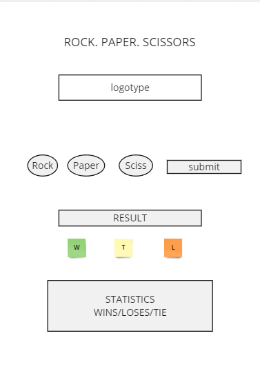
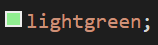
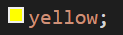
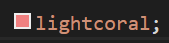
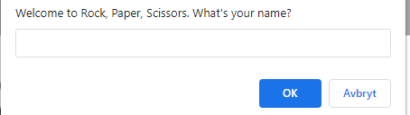
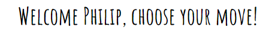

# Rock Paper Scissors

This is a very simple website where you can play the classic Rock, Paper, Scissors game, built with HTML, CSS and JavaScript. 
You play against the computer. The winner is determined by the classic game-rules.
Try it yourselves here! [ Rock, Paper, Scissor Game!](LÄNK TILL HEMSIDA)

![Am i Responsive] LÄNK till bild i readme img

# Usage

##
To play the game, you open the [index.html](index.html) file in your web browser. You enter your name in the alertbox that comes up on the site. Then the game begins.

You choose between the three options, **rock**, **paper** or **scissors**. Then, cklick the **Submit answer** button. The computer choses also an option randomly, and then you can see who wins the game.

The game keeps track of the score for the player, computer and the number of ties, and the statistics are shown below. 

If you win a round, the text "You win!" will appear, and the background is highlighted in green.

If you tie, the text "It is a tie!" appears, and the background is highlighted in yellow.

If you lose against the computer, the text "Computer wins!" appears, and the background is highlighted in red.

## Game Rules

The rules of Rock, Paper, Scissors are very simple. 

Check the rules below:
- The rock beats scissors
- Scissors beats paper
- Paper beats rock
- If you make the same option, then the game is a tie

# User Experience (UX)

##
- The wireframe for this game/website is designed in [Miro](https://miro.com). The wireframe is a good referencs if you are unsure how to build or design your website. 
You can use it to structure up what you should do next for an example. A wireframe is recommended to create for every project you begin with.

## Color choice
I chose to make the colors very and basic. The game is an old and simple game, so it does not require alot of effects, and colors to make it fun to play.
The colors iv'e chosen are a gray-toned color for the backgroun green for win, red for lose and yellow if you tie a game.
This makes it user-friendly and very simple to understand for everyone!

## Structure of the site
- The site are very simple designed, and has only one page, the [index](index.html), where the game are located.
- This site contains a game for you to play, and a scoreboard to keep track of the leader.

# Features
 - The site is very user-friendly, and everyone can use it.

## Exsisting features

### Alert message - What's your name?
- When you enter the website, you will get an alert message, that welcomes you with a text "Welcome to Rock, Paper, Scissors. What's your name?"

### Welcome message
- Right below the header, and the logotype, another message have appeared. It says "WELCOME!" by default.
But when you enter your name (Philip) in the box - the message will change from "WELCOME!" 

- When you have entered your name, the message will look like this "WELCOME PHILIP, CHOOSE YOUR MOVE!"

### Rock, Paper or Scissors options
- Here are three inputs, to make your move against the computer. You select the desired move, and then you use the **Submit Answer** button.
This will "lock" in your answer, and generate a answer for the computer aswell. [Rock Paper Scissors](BILD PÅ INPUTSE OCH KNAPP)

### Selections
- The game will show you what input you chose, and also what the computer selected.
- The computers choice are randomized, and will create a random option between rock, paper or scissors every time you press the **Submit Answer** button!
[My and computer selection](bild på you och computer selected)

### Result
- The result are shown below. 
- If you win, a text will display with "You win!", and a green background will be highlighted. [You win!](i win pic)
- If you lose, a text will display with "Computer wins!", and a red background will be highlighted. [You lose!](i win pic)
- If you tie, a text will be displayed with "It is a tie!", and a yellow background will be highlighted. [You tie!](i win pic)

### Scoreboard
- The scoreboard are located almost all the way down to the page. This will keep track of your winnings, losses and how many ties you have made versus the computer.
- If you want to reset the scoreboard, just refresh the website. [Scoreboard](scoreboard bild)

### Total games played
- This counter will keep track of how many games you have played.
- Just like the scoreboard, this counter will reset if you refresh the website.

## Features to implement in the future

### Spinning wheel
- I want to implement a spinning wheel, or something like that, to make the game more interesting, or exciting. This will be more attractive for the user, and will build a longer play-time. 

# Deployment

## Deploy the project to Github
This project is deployed on Github pages. To deploy something on Github, follow the steps below:
1. Navigate to **Settings** when you are on the project. ! [Github Settings](BILD!!!!)
2. Scroll all the way down to **Pages** on the left side, and press. 
3. There you have a header that's called **Build and deployment**, and a second header that says **Brranch**. Select the **source** to the one where you have created your project in. Its often called **main** or **master**, and press **save**. 
4. After a while, the website will get shown as live, and you will get a link to the desired website. This indicates that everything is done correctly and you can share the link to anyone! This is how the link is supposed to look like when you are finished! (LÄNK TILL PAGES LÄNK) 

### Fork the repository (Github)
You can create a copy of the repository aswell, by use something called forking. To fork the content on Github, 
1. Locate the repo you want to fork.
2. Press **Fork** on the top right side of the page. 
3. Press the green button to make the copy to your own github. 
4. Now you have created a copy to your own github site. This is a good thing if you are going to work with a project, and you are more than one person. It is hard to work in same file at a time.

# Testing

## Validator Testing 
The HTML was validated using [W3C HTML Validator]() 
- CSS showed no errors aswell, and validated with [Jigsaw W3C Validator]()
- My JavaScript was validated, without errors with [ExtendsClass]()

## Lighthouse
- The google chrome has a very good built-in performance-tool that is called Lighthouse.
This was used on my website, and i got a performance on 83/100.
- It showed an error message "form elements do not have associated labels" [FORM ELEMEN ERROR IMG](IMG ON FORM ELEMENT)
and also a error message "document does not have a meta description" [meta desctiption img](METADES BILD)

- I invesitgated my HTML and found out very quick that i forgot to put a label in my code.
So instead of my , i placed a <label>, and a **for** attribute for every option.
- Afterwards, i checked the meta description, and found out i forgot to add the keywords and a description on top of my HTML file [index.html].

- I ran the lighthouse again, and got a much better result. The game was validated to a 100/100 score in Accessibillity. [lightouse fixed img!()]

## Responsiveness
- The game was tested, and worked perfect in two different browesers. Google Chrome, and Safari.
- The responsiveness was tesded on google dev-tools, and worked good in all "normal" dimensions.

# Credits
### Content
* My game-layout was inspired by [freeCodeCamp](https://www.youtube.com/watch?v=jaVNP3nIAv0), and 
[Code with random](https://www.codewithrandom.com/2023/02/17/rock-paper-scissors-game-javascript-rock-paper-scissors-game-html-css/)
* Score-table is inspired by [Slider Revolution](https://www.sliderrevolution.com/resources/css-tables/)
* [W3C Validator](https://validator.w3.org/) for checking validation for HTML
* [Jigsaw W3C Validator](https://jigsaw.w3.org/css-validator/) for checking validation for CSS
* [ExtendsClass](https://extendsclass.com/javascript-fiddle.html) to validate my JavaScript
* The font is from [Google Fonts](https://fonts.google.com/)
* The wireframe is designed & created in [Miro](https://miro.com/)

* Wave webaim was used to check the content to users with disabilities. [Wave Webaim](https://wave.webaim.org/)
* Google Lighthouse was used in Google Chrome developertools to check the performance of the whole website.

### Media
* My images are borrowed from [Adobe Stock](https://stock.adobe.com/)